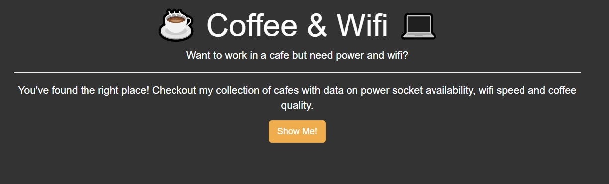
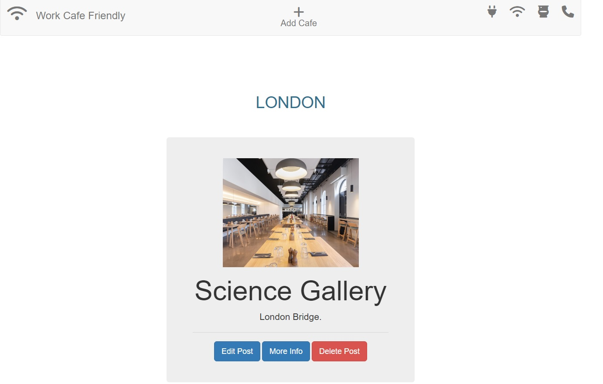
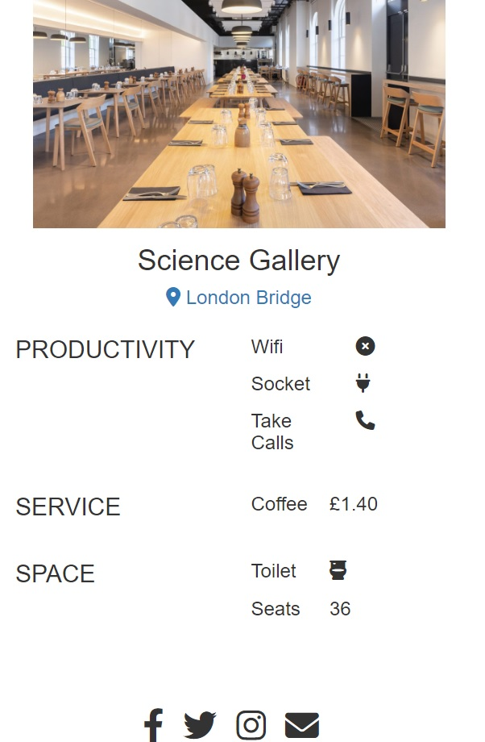
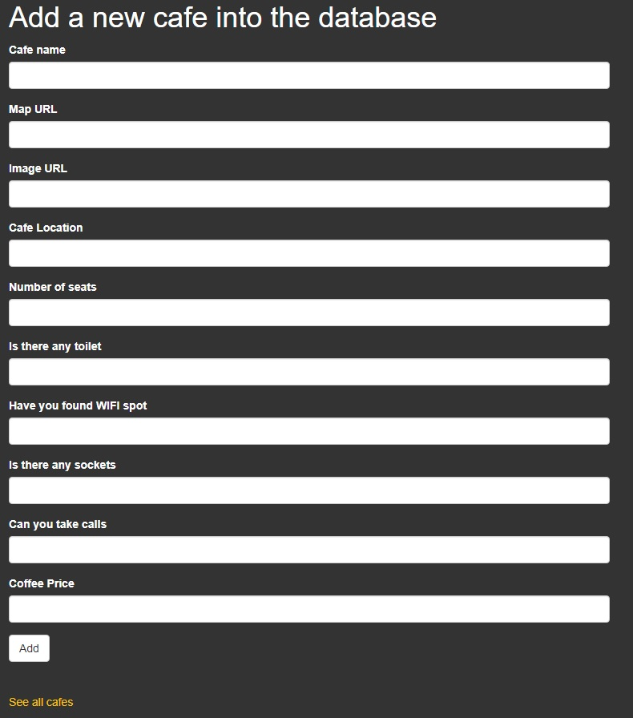

# Cafe and Wifi Website, Python

* As someone who likes coffee, I came up with idea to use some random cafes from London to create database and filled
    it out. Using database and what I learnt about REST APIs and web development, I created a website that 
    uses this data. It should display the cafes, but it could also allow people to add new cafes or delete cafes or
    edit cafes. Also in Navbar I've added more filter options like: sockets cafes, wifi cafes, can take calls cafes, 
    cafes with toilets.

* Website that gave me some inspiration:

  [Cafe and Wifi Example](https://laptopfriendly.co/london)

### Requirements

##### Flask Module:

[Flask docs](https://flask.palletsprojects.com/en/2.2.x/)

##### Jinja1 Template
[Jinja2 docs](https://jinja.palletsprojects.com/en/3.1.x/)

##### Flask-Bootstrap Module:

[Flask-Bootstrap docs](https://bootstrap-flask.readthedocs.io/en/stable/)

##### Flask-SQLalchemy Module:

[Flask-SQLalchemy docs](https://flask-sqlalchemy.palletsprojects.com/en/latest/)

##### Flask-WTForms Module:

[Flask-WTF docs](https://flask-wtf.readthedocs.io/en/1.0.x/)

### Usage

* When open the Web Page, there is pretty bootstrap styled home page. When click show me, it renders all cafes
    from database, styled with some basic front-end where focus in this project is about RESTful routing.
  

* All cafes:

* Every Cafe have three options below image(Edit, More Info, Delete)
    * when clicks on delete button, it delete info pernamently from database.
    * edit button can edit some specified parameters.
    * More info button show more details about Cafe.
    
      
* On top of header there is Add option, to add new cafe into database.

    
### Ideas for future improvements

##### This project as any other have always space for improvements.
    I use a lot ideas to practice and upgrade my skills.
    
* Improve User Interface, User Experience.
* more CSS and Bootstrap Styling.
* Add login and admin benefits to handle more options.
* Create user table in database to interact with cafes to see which user added which cafe.
* Convert sqlite to postgres to host web site live on Heroku.
* Better organise of css and html code, style styles.css.
